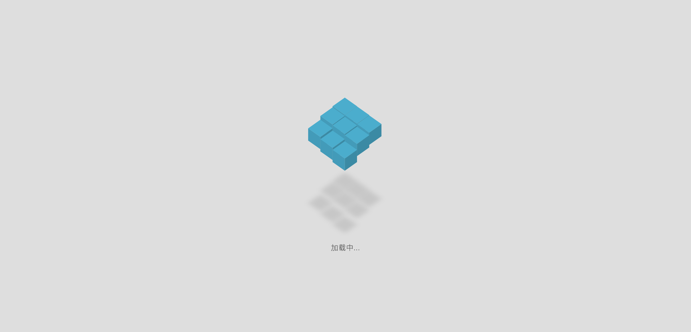

# bookweb

> A Vue.js project

### 这是本人在学习Vue的一个Demo，应用主题为一个图书馆Web，图书馆Web使用的是Vue2.0完成搭建，并且使用了vue-router、axios、bootstrap、jquery等技术，本网站仅仅作为本人学习的demo，如有雷同，纯属巧合 O(∩_∩)O。

# 预览


---------------------------


## Build Setup

``` bash
# install dependencies
npm install

# serve with hot reload at localhost:8080
npm run dev

# build for production with minification
npm run build

# build for production and view the bundle analyzer report
npm run build --report

# run unit tests
npm run unit

# run e2e tests
npm run e2e

# run all tests
npm test
```


For detailed explanation on how things work, checkout the [guide](http://vuejs-templates.github.io/webpack/) and [docs for vue-loader](http://vuejs.github.io/vue-loader).
